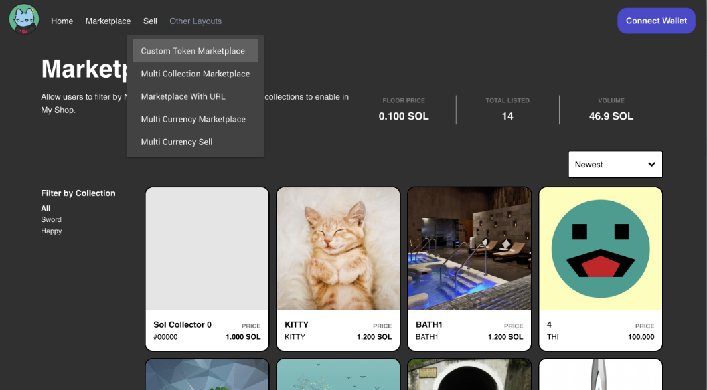

# Solana Candy Machine V2 + Candy Shop

This repo allows you to sell NFTs through Candy Machine V2 and host your own secondary marketplace with [Candy Shop](https://github.com/LIQNFT/candy-shop).
This project is made on React.js
Supports the following marketplace configurations:
* Basic SOL marketplace
* Basic custom SPL token marketplace
* Marketplace with single NFT view
* Multi collection marketplace
* Multi currency marketplace

<!--  -->

**Prod-ready Responsive UI** which can be easily customized in 5mn.

All Candy Machine V2 functionalities are implemented, auto detected and maintained up-to-date:

- public mint (with countdown when date in future)
- civic support (gatekeeper)
- whitelist
- presale true / false
- end date / end number (endSettings)
- spl-token to mint

### Supported Wallets

For instructions on how to set up a V2 candy machine, please refer to Metaplex's documentation [here](https://docs.metaplex.com/candy-machine-v2/Introduction)

## One-Click Vercel Deployment

One-click solution to clone this project to your GitHub and deploy the prod package on a Vercel.
Your only task will be to customize your GitHub fork of this project and commit updates.
Vercel will automatically deploy new prod packages for each new commit.

%20and%20REACT_APP_SOLANA_RPC_HOST%20with%20the%20RPC%20URL%20(example%20for%20devnet%20%3A%20https%3A%2F%2Fapi.devnet.solana.com)&envLink=https%3A%2F%2Fdocs.solana.com%2Fcluster%2Frpc-endpoints%23mainnet-beta&demo-title=My%20Demo%20Mint%20Page&demo-description=A%20one-click%20generated%20solana%20minting%20responsive%20website.&demo-url=https%3A%2F%2Fwww.mintgatsbyclub.net%2F&demo-image=https%3A%2F%2Fi.imgur.com%2FWWSvkBO.png)
